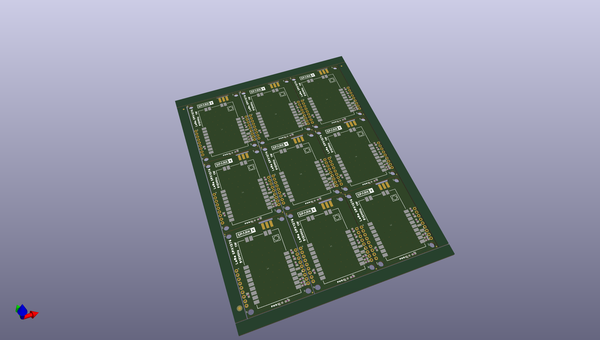

# OOMP Project  
## LoRa_1W_Breakout  by sparkfunX  
  
(snippet of original readme)  
  
SparkFun LoRa 1W Breakout  
========================================  
  
  
  
[*SparkFun LoRa 1W Breakout (SPX-18572)*](https://www.sparkfun.com/products/18572)  
  
Do you need power? This breakout for the 915M30S module from EBYTE is a 1W (30dB) LoRa transceiver. LoRa is great for long range long range (miles), low power (in sleep), and low data rates (~500bps). This breakout board is designed to connect to any platform that has SPI and 6 available GPIO. We include a robust edge mount RP-SMA connector to connect large LoRa (915MHz) antennas. In addition, the on-board U.FL connector can be used if you need to get outside a metal enclosure.   
  
We've successfully broadcast 12 miles line-of-sight (thank you [foothills](https://www.google.com/search?q=boulder+foothills&tbm=isch)!) using this module but your results may vary.  
  
Our example sketches make quick work of the initial setup for the [SX1276 LoRa transceiver](https://www.semtech.com/products/wireless-rf/lora-core/sx1276) from Semtech, and the RadioLib Arduino Library makes advanced configuration and [protocols](https://github.com/jgromes/RadioLib/wiki/Default-configuration-protocols) (AX.25, Hellschreiber, Morse, RTTY, and SSTV) a cinch too!  
  
Repository Contents  
-------------------  
  
* **/Documents** - Datasheets and mechanical drawings  
* **/Hardware** - All Eagle design files   
  full source readme at [readme_src.md](readme_src.md)  
  
source repo at: [https://github.com/sparkfunX/LoRa_1W_Breakout](https://github.com/sparkfunX/LoRa_1W_Breakout)  
## Board  
  
  
## Schematic  
  
  
  
[schematic pdf](working_schematic.pdf)  
## Images  
