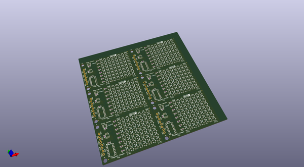

# OOMP Project  
## Magnetic_Imaging_Tile  by sparkfunX  
  
(snippet of original readme)  
  
Magnetic Imaging Tile  
======  
  
  
  
[*SparkFun Magnetic Imaging Tile (SPX-14652)*](https://www.sparkfun.com/products/14652)  
  
The Magnetic Imaging Tile uses an array of 64 hall effect sensors to convert magnetic fields to the visual spectrum. That's right! You can now see magnetic fields in real time! As is to be expected, there are caveats: the magnetic sensors used on the tile are some of the most sensitive on the market but you need to be within 1 to 2 centimeters of the tile to get a good image.  
  
This is a board intended to function as a "magnetic field camera" to visualize magnetic fields.   
  
This is an endorsed fork and collaboration of [Peter Jansen's work](https://hackaday.io/project/18518-iteration-8/log/91551-a-third-high-speed-magnetic-imager-tile). All credit goes to him! SparkX has re-designed the PCB for DFM and simiplified some of the platform interfacing code.  
  
--- Version 3.0  
  
The major advancement of v3.0 is a dramatic increase in the speed with which the tile data can be read out. ~2000 frames per second (fps) can be achieved which allows visualizing even quickly varying fields (e.g. those in a 60Hz transformer, or a moving motor). Version 3.0 reduces the size of the tile to an 8x8 grid of hall effect sensors (64 total), arrayed in a 4mm grid.  The boards is tile-able with up to 4 of the boards tileable with minimal borders to create a 16x16 array.   
  
For mor  
  full source readme at [readme_src.md](readme_src.md)  
  
source repo at: [https://github.com/sparkfunX/Magnetic_Imaging_Tile](https://github.com/sparkfunX/Magnetic_Imaging_Tile)  
## Board  
  
  
## Schematic  
  
  
  
[schematic pdf](working_schematic.pdf)  
## Images  
