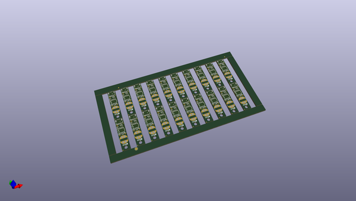

# OOMP Project  
## Micro_RFID_Tag_ST25DV64KC_Qwiic  by sparkfunX  
  
oomp key: oomp_projects_flat_sparkfunx_micro_rfid_tag_st25dv64kc_qwiic  
(snippet of original readme)  
  
- SparkX Micro Dynamic NFC/RFID Tag - ST25DV64KC  
  

  
      
      

  
  
<table class="table table-hover table-striped table-bordered">  
    <tr align="center">  
     <td></td>  
    </tr>  
    <tr align="center">  
        <td><a href="https://www.sparkfun.com/products/20691">SparkX Micro Dynamic RFID Tag - ST25DV64KC (SPX-20691)</a></td>  
    </tr>  
</table>  
  
The STMicroelectronics ST25DV _**dynamic**_ Near Frequency Communication / Radio Frequency Identification tag ICs are awesome! The ST25DV64KC offers 64-kBit (8-kBytes) of EEPROM memory which can be accessed over both I2C and RF (NFC)! It's a state-of-the-art tag which conforms to ISO/IEC 15693 or NFC Forum Type 5 recommendations. You can read and write the tag's memory using NFC even while the tag is powered down or disconnected!  
  
The EEPROM memory can be divided into four areas, each of which can have different levels of protection applied. Want to store your data so everyone has read and write access  
  full source readme at [readme_src.md](readme_src.md)  
  
source repo at: [https://github.com/sparkfunX/Micro_RFID_Tag_ST25DV64KC_Qwiic](https://github.com/sparkfunX/Micro_RFID_Tag_ST25DV64KC_Qwiic)  
## Board  
  
  
## Schematic  
  
  
  
[schematic pdf](working_schematic.pdf)  
## Images  
