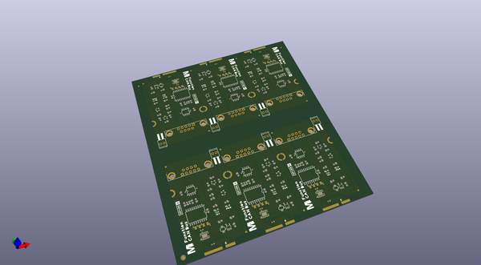

# OOMP Project  
## MicroMod_CAN-Bus_Function_Board  by sparkfunX  
  
oomp key: oomp_projects_flat_sparkfunx_micromod_can_bus_function_board  
(snippet of original readme)  
  
SparkX MicroMod CAN Bus Function Board  
========================================  
  
  
  
[*MicroMod CAN Bus Function Board (SPX-21775)*](https://www.sparkfun.com/products/21775)  
  
Controller Area Network (CAN bus) continues to be a popular communication standard in all sorts of applications from passenger vehicles to lighting control and building automation. This MicroMod function board allows you to add CAN networking to your next MicroMod project.   
  
The CAN communications are handled by the MCP2515 stand-alone CAN controller paired up with an MCP2551 high-speed CAN transceiver. The MCP2515 is a very popular IC for CAN Bus, which means there are a variety of Arduino libraries already available. We quite like Sandeep Mistry's [arduino-CAN Library](https://github.com/sandeepmistry/arduino-CAN). If your processor board has a built-in CAN controller, however, you can change a solder jumper on the bottom of the board to address the CAN transceiver directly, bypassing the MCP2515.  
  
Repository Contents  
-------------------  
  
* **/Hardware** - Eagle design files (.brd, .sch)  
* **/Production** - Production panel files (.brd)  
  
Documentation  
--------------  
    
* **[MCP2515 Datasheet](https://cdn.sparkfun.com/assets/1/0/e/4/0/MCP2515-Family-Data-Sheet-DS20001801K.pdf)** -MCP2515 Stand-Alone CAN Controller  
* **[MCP2551 Datasheet](https://  
  full source readme at [readme_src.md](readme_src.md)  
  
source repo at: [https://github.com/sparkfunX/MicroMod_CAN-Bus_Function_Board](https://github.com/sparkfunX/MicroMod_CAN-Bus_Function_Board)  
## Board  
  
  
## Schematic  
  
  
  
[schematic pdf](working_schematic.pdf)  
## Images  
