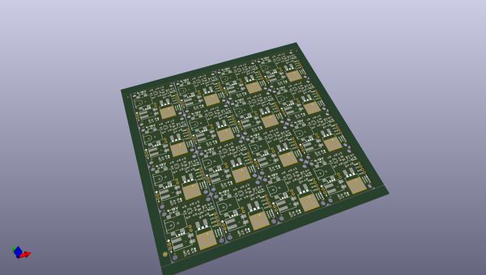

# OOMP Project  
## MOSFET_Power_Switch  by sparkfunX  
  
(snippet of original readme)  
  
SparkFun MOSFET Power Switch  
========================================  
  
  
  
[*SparkFun MOSFET Power Switch (COM-19799)*](https://www.sparkfun.com/products/19799)  
  
Does your Arduino need to control a high voltage item, like a 12V LED strip, while needing to be powered as well? Do you want to avoid having multiple power adapters for your project and your Arduino? The MOSFET Power Switch is one of those products that we needed ourselves at SparkFun, so we figured other folks may have the same problem. Power the board with up to 12V and control up to 10A, all while providing sweet sweet 3.3V to your control board.  
  
This board is ideal for turning on and off large loads such as solenoids, LEDs strips, and DC loads that may have back EMF. Simply pull the CTL pin low to activate the load. 3.3V, GND, and VCC are also provided at PTH headers. The load can be inserted into the poke-home connectors or soldered into PTH holes.  
  
The MOSFET ([PSMN7R0-100BS](https://cdn.sparkfun.com/assets/6/9/3/8/1/PSMN7R0-100BS.pdf)) is rated to 100A/100V but we don't recommend you go much above 10A as the PCB traces become the limiter. The board   
  
  
Repository Contents  
-------------------  
  
* **/Hardware** - Eagle design files (.brd, .sch)  
  
License Information  
-------------------  
  
This product is _**open source**_!   
  
Please review the LICENSE.md f  
  full source readme at [readme_src.md](readme_src.md)  
  
source repo at: [https://github.com/sparkfunX/MOSFET_Power_Switch](https://github.com/sparkfunX/MOSFET_Power_Switch)  
## Board  
  
  
## Schematic  
  
  
  
[schematic pdf](working_schematic.pdf)  
## Images  
