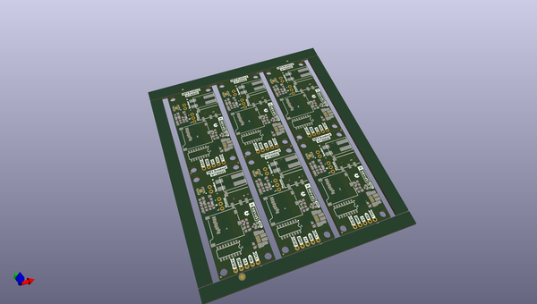

# OOMP Project  
## MP3_Breakout_WT2003S  by sparkfunX  
  
(snippet of original readme)  
  
SparkX WT2003S MP3 Decoder Breakout  
========================================  
  
  
  
[*SparkX Qwiic MP3 Trigger (SPX-14810)*](https://www.sparkfun.com/products/14810)  
  
The WT2003S makes playing MP3 files from an SD card dead simple! All you need to do is load your files onto the sd card, plug in your speakers, and then send a few commands over a serial connection. Any time that you need to play an MP3 this breakout board will do just the trick - for example making an alarm clock that plays your favorite music or maybe making an elaborate voicemail greeting prank...  
  
A microSD card is used to store MP3 files to be played later, then a 3.5mm stereo headphone jack or poke-home speaker output is used to pipe your sound waves into the world. In between is the amazing WT2003S chip that handles the sd interface (via SPI) **and** the decoding of the MP3 format. Another perk is the built-in TPA2005D1 1.4W amplifier so that you can play songs out-loud right out of the box. All of these features fit on a single-sided PCB to make mounting a cinch. All you need to start playing MP3s in your project is:  
  
- WT2003S breakout board  
- Serial connection (Arduino, FTDI converter, etc.)  
- A speaker or headphones  
- An SD card with your favorite jams!  
  
Check out the documents tab for datasheets, Eagle schematics, and an Arduino library that makes getting started too easy!  
  
P.S. if you   
  full source readme at [readme_src.md](readme_src.md)  
  
source repo at: [https://github.com/sparkfunX/MP3_Breakout_WT2003S](https://github.com/sparkfunX/MP3_Breakout_WT2003S)  
## Board  
  
  
## Schematic  
  
  
  
[schematic pdf](working_schematic.pdf)  
## Images  
