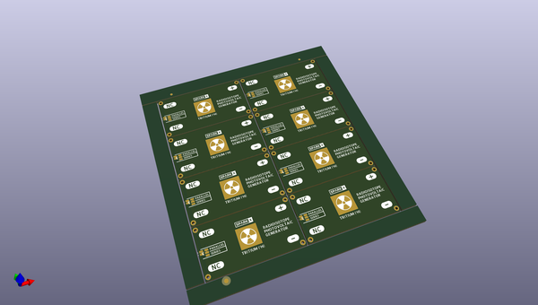

# OOMP Project  
## Nuclear_Battery_Kit  by sparkfunX  
  
(snippet of original readme)  
  
- Nuclear_Battery_Kit  
Bring Your Own Tritium Radioisotope Photovoltaic Cell Kit  
  
https://www.sparkfun.com/products/14773  
  
After we caught sight of some very cool folks online making their very own homemade nuclear batteries, we knew we had to give it a go!  
  
The device in question is actually known as a “Radioisotope Photovoltaic Generator” or “Photobetavoltaic Generator,” and it’s a pretty clever design: Glowing glass pills filled with Tritium gas and coated in a phosphorescent material are sandwiched between two photovoltaic cells. The beta radiation emitted by the Tritium is blocked by the glass walls of the pill, but they cause the phosphorescent coating to glow. This light has no trouble passing through the glass and lands on the photovoltaic cells where it produces a small amount of electricity! Commercial Tritium batteries — like those produced by City Labs — cut out the middleman by using betavoltaic (as opposed to photovoltaic) cells in direct contact with Tritium gas. Those commercial devices are more rugged and efficient, but come with a very large price tag (thousands of USD per unit). On the other hand, homemade devices constructed using the packing tape sandwich method are as cheap as it gets, but aren’t particularly rugged.  
  
This kit provides a good compromise between price and quality of construction. We’ve designed carrier boards for both of the photovoltaic cells which we supply pre-soldered and fixed to the boards with chipbonder. We’ve also designed and cas  
  full source readme at [readme_src.md](readme_src.md)  
  
source repo at: [https://github.com/sparkfunX/Nuclear_Battery_Kit](https://github.com/sparkfunX/Nuclear_Battery_Kit)  
## Board  
  
  
## Schematic  
  
  
  
[schematic pdf](working_schematic.pdf)  
## Images  
