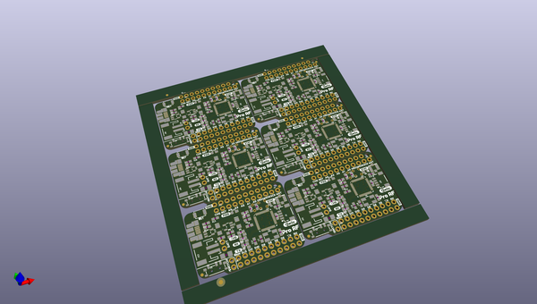

# OOMP Project  
## Pro_RF  by sparkfunX  
  
oomp key: oomp_projects_flat_sparkfunx_pro_rf  
(snippet of original readme)  
  
SparkFun ProRF with RFM69/RFM95 LoRa  
========================================  
  
  
  
[*SparkX ProRF (SPX-14785)*](https://www.sparkfun.com/products/14785)  
  
The Pro RF is the mind meld of a Pro Micro and a long-range RFM95W LoRa®-enabled radio. What you get is a very compact, easy to use Arduino with excellent point to point data transmission in the 915MHz ISM band. The Pro RF comes with a LiPo connector, a on-board LiPo charger, and a slide switch for On/Off. The board programs over a reinforced microB connector with a sleek reset button that fits nicely on the side of the board. We've even added our popular [Qwiic connector](https://www.sparkfun.com/qwiic) to the edge of the board making it incredibly fast to add sensors and actuators.  
  
Thanks to the [Arduino LoRa library](https://github.com/sandeepmistry/arduino-LoRa), the RFM95W radio is an easy to use packet radio. But it doesn't stop at point-to-point packet radio because closing a few jumpers will give the Pro RF access to the DIO pins on the RFM95W which are necessary to operate in LoRaWAN mode, so you can use the Pro RF as a LoRaWAN node in a distributed sensor network such as [The Things Network](https://www.thethingsnetwork.org/).  
  
The Pro RF also includes a power switch and 2-pin JST connector for powering from a lithium battery. With the power switch in the off position, the Pro RF will even charge the attached  
  full source readme at [readme_src.md](readme_src.md)  
  
source repo at: [https://github.com/sparkfunX/Pro_RF](https://github.com/sparkfunX/Pro_RF)  
## Board  
  
  
## Schematic  
  
  
  
[schematic pdf](working_schematic.pdf)  
## Images  
