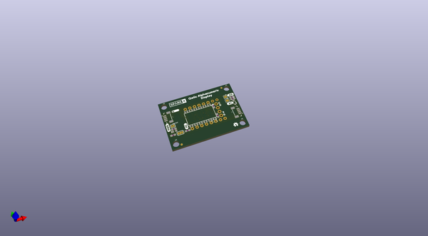

# OOMP Project  
## Qwiic_Alphanumeric_Display  by sparkfunX  
  
(snippet of original readme)  
  
SparkX Qwiic Alphanumeric Display  
========================================  
  
  
  
[*Qwiic Alphanumeric Display - Red (SPX-16427)*](https://www.sparkfun.com/products/16427)  
  
  
  
[*Qwiic Alphanumeric Display - Blue (SPX-16426)*](https://www.sparkfun.com/products/16426)  
  
  
  
[*Qwiic Alphanumeric Display - Purple (SPX-16425)*](https://www.sparkfun.com/products/16425)  
  
  
  
[*Qwiic Alphanumeric Display - Pink (SPX-16391)*](https://www.sparkfun.com/products/16391)  
  
The SparkFun Qwiic Alphanumeric Display is a 14-segment, 4 digit alphanumeric display with the Hotlek HT16K33 LED Driver. The I2C address is configurable, so daisy-chain up to 4 displays on one bus! Looking for the library? Click [*here*](https://github.com/sparkfun/SparkFun_Alphanumeric_Display_Arduino_Library)  
  
SparkFun labored with love to design this b  
  full source readme at [readme_src.md](readme_src.md)  
  
source repo at: [https://github.com/sparkfunX/Qwiic_Alphanumeric_Display](https://github.com/sparkfunX/Qwiic_Alphanumeric_Display)  
## Board  
  
  
## Schematic  
  
  
  
[schematic pdf](working_schematic.pdf)  
## Images  
