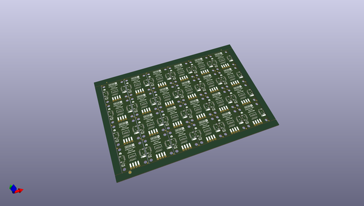

# OOMP Project  
## Qwiic_Ambient_Light_Sensor_VEML7700  by sparkfunX  
  
(snippet of original readme)  
  
SparkX Ambient Light Sensor - VEML7700 (Qwiic)  
========================================  
  
  
  
[*SparkX Ambient Light Sensor - VEML7700 (Qwiic) (SPX-18981)*](https://www.sparkfun.com/products/18981)  
  
The VEML7700 is a high accuracy, 16-bit resolution, digital ambient light sensor in a miniature transparent 6.8 mm x 3.0 mm x 2.5 mm package.  
It includes a high sensitivity photodiode, a low noise amplifier, a 16-bit A/D converter and supports an easy to use I2C bus communication interface.  
  
* FiltronTM technology adaption: close to real human eye response  
* O-TrimTM technology adoption: ALS output tolerance ≤ 10 %  
* 16-bit dynamic range for ambient light detection from 0 lx to about 167 klx with resolution down to 0.005 lx/count  
* 100 Hz and 120 Hz flicker noise rejection  
* Excellent temperature compensation  
* High dynamic detection resolution  
* Software shutdown mode control  
* High and low threshold windows with interrupt flags  
  
Our [Arduino Library](https://github.com/sparkfun/SparkFun_VEML7700_Arduino_Library) converts the raw sensor data into lux,  
automatically compensating for the sensor's gain and integration time settings.  
  
Repository Contents  
-------------------  
  
- [**/Documents**](./Documents) - datasheets etc.  
- [**/Hardware**](./Hardwar  
  full source readme at [readme_src.md](readme_src.md)  
  
source repo at: [https://github.com/sparkfunX/Qwiic_Ambient_Light_Sensor_VEML7700](https://github.com/sparkfunX/Qwiic_Ambient_Light_Sensor_VEML7700)  
## Board  
  
  
## Schematic  
  
  
  
[schematic pdf](working_schematic.pdf)  
## Images  
