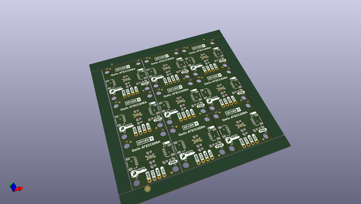

# OOMP Project  
## Qwiic_ATECC608A  by sparkfunX  
  
(snippet of original readme)  
  
SparkFun Cryptographic Co-Processor Breakout - ATECC608A (Qwiic)  
========================================  
  
  
  
[*SparkFun Cryptographic Co-Processor Breakout - ATECC608A (Qwiic) (SPX-15838)*](https://www.sparkfun.com/products/15838)  
  
The SparkX ATECC608A Cryptographic Co-processor Breakout allows you to add strong security to your IoT node, edge device, or embedded system. This includes <strong><u>a</u>symmetric</strong> authentication, <strong>symetric</strong> AES-128 encryption/decryption, and much more. Note, the ATECC608A has limited Arduino support and the complete datasheet is under NDA with Microchip.  
  
This breakout board includes two Qwiic ports for plug and play functionality. Utilizing our handy Qwiic system, no soldering is required to connect it to the rest of your system. However, we still have broken out 0.1"-spaced pins in case you prefer to use a breadboard. The ATECC608A chip is capable of many cryptographic processes, including, but not limited to:  
  
* Creating and securely storing unique asymmetric key pairs based on Elliptic Curve Cryptography (FIPS186-3).  
* AES-128: Encrypt/Decrypt, Galois Field Multiply for GCM  
* Creating and verifying 64-byte digital signatures (from 32-bytes of message data).  
* Creating a shared secret key on a public channel via Elliptic Curve Diffie-H  
  full source readme at [readme_src.md](readme_src.md)  
  
source repo at: [https://github.com/sparkfunX/Qwiic_ATECC608A](https://github.com/sparkfunX/Qwiic_ATECC608A)  
## Board  
  
  
## Schematic  
  
  
  
[schematic pdf](working_schematic.pdf)  
## Images  
