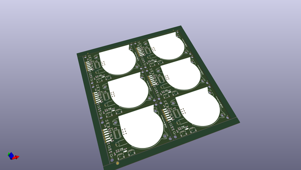

# OOMP Project  
## Qwiic_Blower_Fan  by sparkfunX  
  
(snippet of original readme)  
  
Qwiic Blower Fan  
========================================  
  
[  
  
[*Qwiic Blower Fan (SPX-18561)*](https://www.sparkfun.com/products/18561)  
  
The unmistakable sounds of a tiny cooling fan spooling up usually means you've sat your laptop on a soft surface, or launched one too many tabs in your browser. It's a textbook cry for help from all of our favorite consumer electronics but what if your next hardware project could also complain about overheating? Well now it can!  
  
In all seriousness, though, sometimes you need to move a little air around. Whether for active cooling or ventilation, a tiny fan can make a big difference. However, a tiny fan also has tiny wires which can make it difficult to work with. We've remedied this issue by mounting it to a board along with the mating flat-flex connector, a voltage booster and an ATtiny-based driver so you can power and control the fan over the Qwiic bus.  
  
The control firmware monitors the tachometer output of the fan in order to implement PI Control over the fan speed, allowing you to set your desired speed in real units. It's also possible to disable the PI control loop and set the speed as a proportion of the maximum. The accompanying Arduino library includes example code for controlling the fan, tweaking settings, and even setting the fan speed based on an attached Qwiic Temperature Sensor and a lookup table.  
  
We're unable to find a datas  
  full source readme at [readme_src.md](readme_src.md)  
  
source repo at: [https://github.com/sparkfunX/Qwiic_Blower_Fan](https://github.com/sparkfunX/Qwiic_Blower_Fan)  
## Board  
  
  
## Schematic  
  
  
  
[schematic pdf](working_schematic.pdf)  
## Images  
