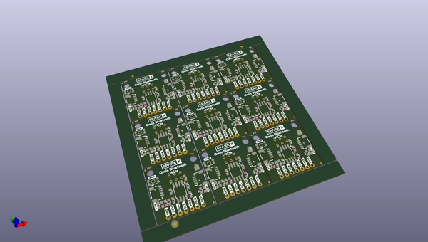

# OOMP Project  
## Qwiic_Bluetooth_HC1x  by sparkfunX  
  
oomp key: oomp_projects_flat_sparkfunx_qwiic_bluetooth_hc1x  
(snippet of original readme)  
  
SparkFun Qwiic Bluetooth  
========================================  
  
  
  
[*SparkX Qwiic Bluetooth (SPX-14840)*](https://www.sparkfun.com/products/14840)  
  
Bluetooth is a great addition to a variety of projects, but the interface to most Bluetooth modules is through a serial UART, which can be a real bummer -- serial port availability can be limited and they're not always super-reliable. The Qwiic Bluetooth aims resolve that issue by providing an I2C interface to the HM-13 Bluetooth module.  
  
This board's HM-13 Bluetooth module supports both SPP (Serial Port Profile) and BLE (Bluetooth low-energy) Bluetooth profiles via Bluetooth 4.0. The HM-13's support for BLE means it's compatible with any smartphone.  Or you can connect it to a computer via the old standard -- SPP -- and use it as a transparent Bluetooth data gateway. You can even use it in dual-mode, connected to a pair of devices simultaneously!  
  
The board also features an ATTiny85, which has custom firmware to translate between between I2C and serial. There are a pair of Qwiic connectors, which allow you to string a variety of sensors up to a single I2C bus. Finally, a green "CON" LED indicates connection status -- blinking when disconnected and solid when connected.  
  
Check out our [HM-13 Arduino library](https://github.com/sparkfun/SparkF  
  full source readme at [readme_src.md](readme_src.md)  
  
source repo at: [https://github.com/sparkfunX/Qwiic_Bluetooth_HC1x](https://github.com/sparkfunX/Qwiic_Bluetooth_HC1x)  
## Board  
  
  
## Schematic  
  
  
  
[schematic pdf](working_schematic.pdf)  
## Images  
