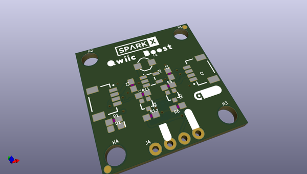

# OOMP Project  
## Qwiic_Boost  by sparkfunX  
  
oomp key: oomp_projects_flat_sparkfunx_qwiic_boost  
(snippet of original readme)  
  
Qwiic Boost  
===========  
  
  
  
[*Qwiic Boost (SPX-17238)*](https://www.sparkfun.com/products/17238)  
  
  
Qwiic Boost increases the Qwiic bus from 3.3V to 5V while still providing the target device with 3.3V I2C signals. This is a handy board for connecting technologies that still require 5V for running higher voltage mechanisms (like a DC fan) but have an internal processor running at 3.3V. We've seen this a lot with air quality sensors that use a fan to push air into a test chamber.  
  
Repository Contents  
-------------------  
  
* **/Hardware** - Eagle design files (.brd, .sch)  
  
License Information  
-------------------  
  
This product is _**open source**_!   
  
Please review the LICENSE.md file for license information.   
  
If you have any questions or concerns on licensing, please contact technical support on our [SparkFun forums](https://forum.sparkfun.com/viewforum.php?f=152).  
  
Distributed as-is; no warranty is given.  
  
- Your friends at SparkFun.  
  full source readme at [readme_src.md](readme_src.md)  
  
source repo at: [https://github.com/sparkfunX/Qwiic_Boost](https://github.com/sparkfunX/Qwiic_Boost)  
## Board  
  
  
## Schematic  
  
  
  
[schematic pdf](working_schematic.pdf)  
## Images  
