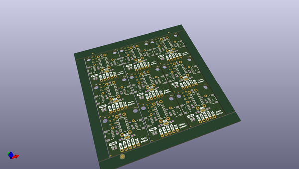

# OOMP Project  
## Qwiic_Button  by sparkfunX  
  
(snippet of original readme)  
  
SparkFun Qwiic Button  
========================================  
<table class="table table-hover table-striped table-bordered">  
  <tr align="center">  
   <td></td>  
   <td></td>  
  </tr>  
  <tr align="center">  
    <td><a href="https://www.sparkfun.com/products/15584">SparkFun Qwiic Button - Red (SPX-15584)</a></td>  
    <td><a href="https://www.sparkfun.com/products/15585">SparkFun Qwiic Arcade - Blue (SPX-15585)</a></td>  
  </tr>  
</table>  
  
The SparkFun Qwiic Button is an I2C enabled button with a built-in LED, interrupts, variable I2C address, and onboard button queues.  
  
Repository Contents  
-------------------  
  
* **/Documentation** - Data sheets, additional product information  
* **/Hardware** - Eagle design files (.brd, .sch)  
* **/Hardware/Production** - Production panel files (.brd)  
  
Documentation  
--------------  
* **[SparkFun Qwiic Button Arduino Library](https://github.com/sparkfun/SparkFun_Qwiic_Button_Arduino_Library)** - Arduino library for the Qwiic Button and Switch.  
  
Firmware  
--------------  
* **[SparkFun Qwiic Switch](https://github.com/sparkfunX/Qwiic_Switch)** - Firmware for the Qwiic Button/Switch/Arcade.  
  
License Information  
-------------------  
  
This product i  
  full source readme at [readme_src.md](readme_src.md)  
  
source repo at: [https://github.com/sparkfunX/Qwiic_Button](https://github.com/sparkfunX/Qwiic_Button)  
## Board  
  
  
## Schematic  
  
  
  
[schematic pdf](working_schematic.pdf)  
## Images  
