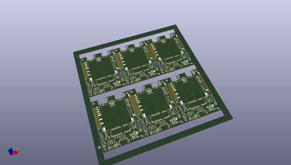

# OOMP Project  
## Qwiic_Cellular-Notecarrier  by sparkfunX  
  
(snippet of original readme)  
  
SparkFun Qwiic Cellular Notecarrier - Blues Wireless  
========================================  
  
  
  
[*SparkX Qwiic Cellular Notecarrier (SPX-17114)*](https://www.sparkfun.com/products/17114)  
  
When we first saw the Notecard from [Blues Wireless](https://blues.io/) we were intrigued. Unlike most embedded cellular modems, the price of the Blues Wireless card includes a 10 year subscription and 500MB of data. A global cellular module with a built in SIM card with no monthly fee? That sounds enticing. After all, the last thing we need is a hot water heater monitor with a monthly cell phone bill!  
  
The power of Qwiic just keeps expanding! Simply plug the Qwiic Cellular Notecarrier onto any enabled SparkFun Qwiic platforms (currently [over 30](https://www.sparkfun.com/qwiic-products)) and you’ll be able to transmit data anywhere there is cell connectivity with a few lines of Python, Arduino, or JSON. The Blues documentation is superb. All [API calls](https://dev.blues.io/reference/notecard-api/) come with extensive C, Python, and JSON examples. While the Qwiic Cellular focuses on using the I2C bus for communication, USB and Serial can also be used to communicate with the Notecard. We found the USB was handy for immediate gratification and command debugging.  
  
The Notecard module comes with integrated cellular, SIM, onboard GPS, accel  
  full source readme at [readme_src.md](readme_src.md)  
  
source repo at: [https://github.com/sparkfunX/Qwiic_Cellular-Notecarrier](https://github.com/sparkfunX/Qwiic_Cellular-Notecarrier)  
## Board  
  
  
## Schematic  
  
  
  
[schematic pdf](working_schematic.pdf)  
## Images  
