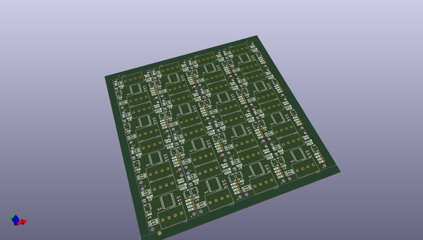

# OOMP Project  
## Qwiic_GPIO  by sparkfunX  
  
oomp key: oomp_projects_flat_sparkfunx_qwiic_gpio  
(snippet of original readme)  
  
SparkX Qwiic GPIO  
=======================================  
  
  
  
[*SparkX Qwiic GPIO (SPX-16443)*](https://www.sparkfun.com/products/16443)  
  
TCA9534 breakout board with Qwiic connectors and easy-to-use latch terminals; no longer screw wires into place! Use this board to add more GPIO pins to your system.  
  
Repository Contents  
-------------------  
  
* **/Documents** - Contains datasheets and schematic.pdf  
* **/Hardware** - Current .brd and .sch files for product  
* **/Software** - Examples to get started with Qwiic GPIO  
  
License Information  
-------------------  
  
This product is _**open source**_!  
  
Please review the LICENSE.md file for license information.  
  
If you have any questions or concerns on licensing, please contact technical support on our [SparkFun forums](https://forum.sparkfun.com/viewforum.php?f=152).  
  
Distributed as-is; no warranty is given.  
  
- Your friends at SparkFun.  
  
_<COLLABORATION CREDIT>_  
  
  full source readme at [readme_src.md](readme_src.md)  
  
source repo at: [https://github.com/sparkfunX/Qwiic_GPIO](https://github.com/sparkfunX/Qwiic_GPIO)  
## Board  
  
  
## Schematic  
  
  
  
[schematic pdf](working_schematic.pdf)  
## Images  
