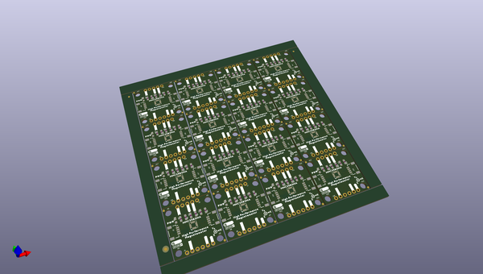

# OOMP Project  
## Qwiic_High_Performance_Magnetometer_MMC5983MA  by sparkfunX  
  
oomp key: oomp_projects_flat_sparkfunx_qwiic_high_performance_magnetometer_mmc5983ma  
(snippet of original readme)  
  
- SparkX MMC5983MA Magnetometer Breakout  
  

  
    
    
    

  
  
  
  
*[SparkX Triple Axis Magnetometer - MMC5983MA (Qwiic) (SPX-19034)](https://www.sparkfun.com/products/19034)*  
  
The MMC5983MA is a highly sensitive triple axis magnetometer by MEMSIC.  
It is capable of sensing down to 0.4mG enabling a heading accuracy of ±0.5°.  
Output rates of 1000Hz, ±8G FSR, and 18-bit resolution make the MMC5983MA a phenomenal magnetic sensor for electronic compass applications.  
  
--- Important Note:  
  
An updated version of this product is available:  
  
[]  
  full source readme at [readme_src.md](readme_src.md)  
  
source repo at: [https://github.com/sparkfunX/Qwiic_High_Performance_Magnetometer_MMC5983MA](https://github.com/sparkfunX/Qwiic_High_Performance_Magnetometer_MMC5983MA)  
## Board  
  
  
## Schematic  
  
  
  
[schematic pdf](working_schematic.pdf)  
## Images  
