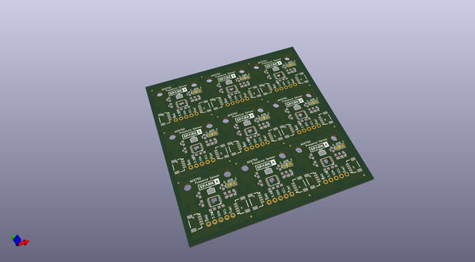

# OOMP Project  
## Qwiic_Human_Presence_Sensor-AK9750  by sparkfunX  
  
oomp key: oomp_projects_flat_sparkfunx_qwiic_human_presence_sensor_ak9750  
(snippet of original readme)  
  
Qwiic Human Presence Sensor - AK9750  
========================================  
  
  
  
[*SPX-14289*](https://www.sparkfun.com/products/14289)  
  
The AK9750 is a passive infrared sensor with four discrete sensors built into one digital package. PIRs are most often used in security systems to detect the movement of a human talking through the room. If you've ever seen a 1" white sphere in the corner of a room, that's a PIR. We sell a [simple PIR](https://www.sparkfun.com/products/13285) as well. The problem with PIRs is many fold. The vast majority of PIRs use a simple on/off interface. The AK9750 is a digital sensor giving you a 16-bit digital value over I2C. Furthermore, the AK9750 has *four* sensors built in! This allows you to detect not only presence but relative distance and direction of movement (for example: PIR2 went off then PIR4 went off so the human is moving left to right).  
  
Each of the four sensors outputs the IR current in pico-amps (-14,286 to 14,286pA). A PIR reading can vary from roughly -200 (no human present) to 1500 when a human is detected standing in front of a given channel but it varies due to environmental factors and other heat sources in view. We've written a library to control the sensor and included a examples showing how to output the sensor readings. We've also written a Processing sketch to visualize the IR sensor readings in real time.  
  full source readme at [readme_src.md](readme_src.md)  
  
source repo at: [https://github.com/sparkfunX/Qwiic_Human_Presence_Sensor-AK9750](https://github.com/sparkfunX/Qwiic_Human_Presence_Sensor-AK9750)  
## Board  
  
  
## Schematic  
  
  
  
[schematic pdf](working_schematic.pdf)  
## Images  
