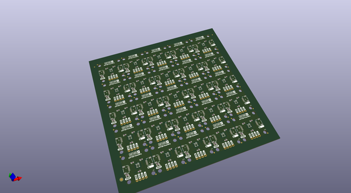

# OOMP Project  
## Qwiic_Humidity_AHT20  by sparkfunX  
  
(snippet of original readme)  
  
SparkFun Qwiic Humidity AHT20  
=============================  
  
  
  
New from SparkX, the AHT20 breakout board. This low-cost IC triggers temperature and humidity measurements easily over the Qwiic bus you know and love.  
  
SparkFun labored with love to design this board. Feel like supporting open-source hardware?  
Buy a [board](https://www.sparkfun.com/) from SparkFun!  
  
Repository Contents  
-------------------  
  
* **/Documents** - Datasheet for the AHT20 IC.  
* **/Hardware** - Eagle design files (.brd, .sch).  
* **/Production** - Production panel files (.brd).  
  
License Information  
-------------------  
  
This product is _**open source**_!  
  
Please review the LICENSE.md file for license information.  
  
If you have any questions or concerns regarding our licensing, please contact technical support on our [SparkFun Forum](https://www.sparkfun.com/viewforum.php?f=152).  
  
Distributed as-is; no warranty is given.  
  
- Your friends at SparkFun  
  
_<COLLABORATION CREDIT>_  
  
  full source readme at [readme_src.md](readme_src.md)  
  
source repo at: [https://github.com/sparkfunX/Qwiic_Humidity_AHT20](https://github.com/sparkfunX/Qwiic_Humidity_AHT20)  
## Board  
  
  
## Schematic  
  
  
  
[schematic pdf](working_schematic.pdf)  
## Images  
