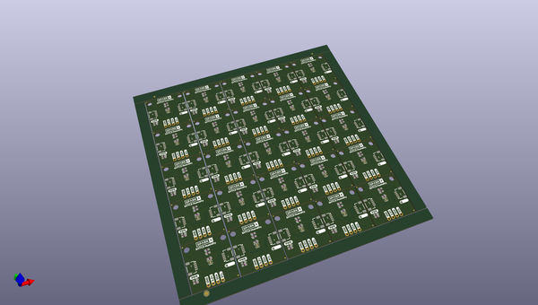

# OOMP Project  
## Qwiic_Humidity_SHTC3  by sparkfunX  
  
(snippet of original readme)  
  
SparkX Qwiic Humidity SHTC3  
========================================  
  
  
  
[*Qwiic Humidity SHTC3*](https://www.sparkfun.com/products/15074)  
  
<Basic description of the part.>  
  
Repository Contents  
-------------------  
  
* **/Documentation** - Data sheets, additional product information  
* **/Enclosure** - Enclosure files   
* **/Firmware** - Example code   
* **/Hardware** - Eagle design files (.brd, .sch)  
* **/Libraries** - Libraries for use with the <PRODUCT NAME>  
* **/Production** - Production panel files (.brd)  
* **/Software** - Related software for the <PRODUCT NAME>  
  
Documentation  
--------------  
* **[Arduino Library](https://github.com/sparkfun/SparkFun_SHTC3_Arduino_Library)** - Arduino Library.  
* **[Hookup Guide](https://learn.sparkfun.com/tutorials/sparkfun-humidity-sensor-breakout---shtc3-qwiic-hookup-guide)** - Basic hookup guide for the.  
* **[SparkFun Fritzing repo](https://github.com/sparkfun/Fritzing_Parts)** - Fritzing diagrams for SparkFun products.  
* **[SparkFun 3D Model repo](https://github.com/sparkfun/3D_Models)** - 3D models of SparkFun products.   
* **[SparkFun Graphical Datasheets](https://github.com/sparkfun/Graphical_Datasheets)** -Graphical Datasheets for various SparkFun products.  
  
Product Versions  
----------------  
* [Part SKU](part URL)- Basic part and short description here  
* [Retail part SKU] (retail URL)- Retail packaging of sta  
  full source readme at [readme_src.md](readme_src.md)  
  
source repo at: [https://github.com/sparkfunX/Qwiic_Humidity_SHTC3](https://github.com/sparkfunX/Qwiic_Humidity_SHTC3)  
## Board  
  
  
## Schematic  
  
  
  
[schematic pdf](working_schematic.pdf)  
## Images  
