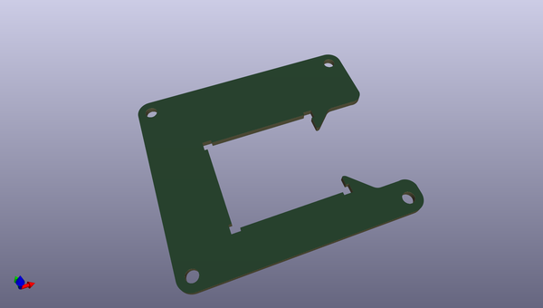

# OOMP Project  
## Qwiic_IMU_BNO080  by sparkfunX  
  
(snippet of original readme)  
  
SparkFun Qwiic VR IMU with the BNO080  
========================================  
  
  
  
[*SparkX IMU BNO080 (SPX-14586)*](https://www.sparkfun.com/products/14586)  
  
  
The BNO080/BNO085 IMU has a combination triple axis accelerometer/gyro/magnetometer packaged with an ARM Cortex M0+ running powerful algorithms. This enables the BNO080 Inertial Measurement Unit (IMU) to produce accurate rotation vector headings with an error of 5 degrees or less. It's what we've been waiting for: all the sensor data is combined into meaningful, accurate IMU information.  
  
This IC was designed to be implemented in Android based cellular phones to handle all the computations necessary for virtual reality goggles using only your phone. The sensor is quite powerful but with power comes a complex interface. We've written an I2C based library that provides the rotation vector (the reading most folks want from an IMU) as well as raw acceleration, gyro, and magnetometer readings. The sensor is capable of communicating over SPI and UART as well!  
  
In addition the BNO080 IMU provides a built-in step counter, tap detector, activity classifier (are you running, walking, or sitting still?), and a shake detector. We are duly impressed.  
  
Repository Contents  
-------------------  
  
* **/Documents** - Datasheets  
* **/Firmware** - Just the test routine for the testjig. Please see the  
  full source readme at [readme_src.md](readme_src.md)  
  
source repo at: [https://github.com/sparkfunX/Qwiic_IMU_BNO080](https://github.com/sparkfunX/Qwiic_IMU_BNO080)  
## Board  
  
  
## Schematic  
  
  
  
[schematic pdf](working_schematic.pdf)  
## Images  
