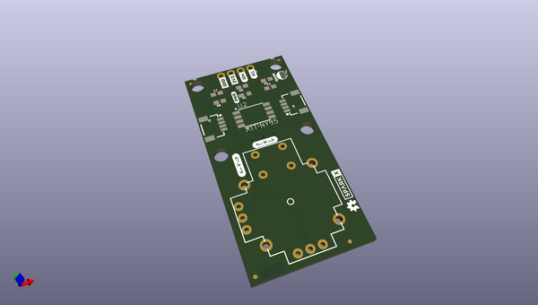

# OOMP Project  
## Qwiic_Joystiic  by sparkfunX  
  
oomp key: oomp_projects_flat_sparkfunx_qwiic_joystiic  
(snippet of original readme)  
  
- Qwiic_Joystiic  
Thumbstick Breakout for the Qwiic System  
    
Factory Default I2C Slave Address: 0x20   
   
<h3 style="text-decoration: underline;">I2C Registers</h3>   
  
| Address | Contents |  
| ------- | -------- |  
| 0x00-0x01 | Horizontal Position (MSB First) |  
| 0x02-0x03 | Vertical Position (MSB First) |  
| 0x04 | Button Position |  
| 0x06 | Current I2C Slave Address from EEPROM |  
   
<h3 style="text-decoration: underline;">I2C Commands</h3>   
  
| Address | Command |  
| ------- | ------- |  
| 0x05 | Set I2C Slave Address |  
  
  full source readme at [readme_src.md](readme_src.md)  
  
source repo at: [https://github.com/sparkfunX/Qwiic_Joystiic](https://github.com/sparkfunX/Qwiic_Joystiic)  
## Board  
  
  
## Schematic  
  
  
  
[schematic pdf](working_schematic.pdf)  
## Images  
