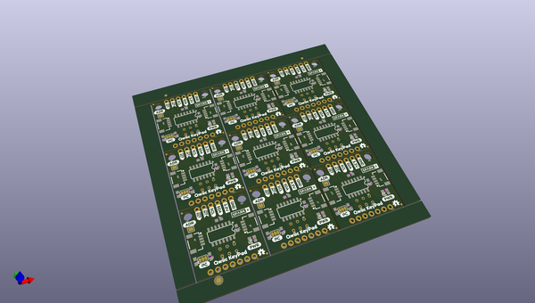

# OOMP Project  
## Qwiic_Keypad  by sparkfunX  
  
oomp key: oomp_projects_flat_sparkfunx_qwiic_keypad  
(snippet of original readme)  
  
SparkFun Qwiic KeyPad  
========================================  
  
  
  
[*SparkX Qwiic Keypad (SPX-14836)*](https://www.sparkfun.com/products/14836)  
  
Keypads are very handy input devices. And there are many great libraries written to interface to keypads! But who wants to tie up 7 GPIOs, have a handful of pull up resistors, and write firmware that scans the keys taking up valuable megahertz? Let’s make it easier! The Qwiic Keypad uses very simple I2C commands to read what button was pressed. It also implements a stack with time stamps for each key press so you don’t need to constantly poll the keypad. Qwiic Keypad even has a configurable I2C address so you can have multiple keypads on the same bus!  
  
Qwiic Keypad is very low power and uses less than 4mA at 3.3V. There are jumpers on the board allowing the user to select between different I2C addresses as well as to remove the I2C pull up resistors if needed.  
  
The Qwiic Keypad comes fully assembled and uses the simple [Qwiic interface](https://www.sparkfun.com/qwiic). No soldering, no voltage translation, no figuring out which pin is SDA or SCL, just plug and go!  
  
Repository Contents  
-------------------  
  
* **/Examples** - A number of examples to show how to read buttons with time, change the I2C address and scan for I2C devices  
* **/Firmware** - The core sketch that runs Qwiic Keypad  
* **/Hardware** - Eagle design files (.brd, .sch)  
  
Li  
  full source readme at [readme_src.md](readme_src.md)  
  
source repo at: [https://github.com/sparkfunX/Qwiic_Keypad](https://github.com/sparkfunX/Qwiic_Keypad)  
## Board  
  
  
## Schematic  
  
  
  
[schematic pdf](working_schematic.pdf)  
## Images  
