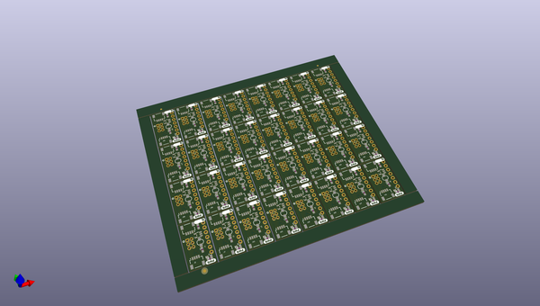

# OOMP Project  
## Qwiic_Lidar_Lite  by sparkfunX  
  
(snippet of original readme)  
  
SparkFun Qwiic LIDAR Lite v4  
========================================  
  
  
  
<table class="table table-hover table-striped table-bordered">  
  <tr align="center">  
   <td></td>  
   <td></td>  
  </tr>  
  <tr align="center">  
   <td><i>Qwiic LIDAR-Lite v4 [<a href="https://www.sparkfun.com/products/15777">SPX-15777</a>]</i></td>  
   <td><i>Garmin LIDAR-Lite v4 LED - Distance Measurement Sensor [<a href="https://www.sparkfun.com/products/15776">SEN-15776</a>]</i></td>  
  </tr>  
</table>  
  
Arduino library for GARMIN LIDAR Lite v4: high-performance optical distance sensing.  
  
  
Repository Contents  
-------------------  
  
* **/examples** - Example sketches for the library (.ino). Run these from the Arduino IDE.  
* **/src** - Source files for the library (.cpp, .h).  
* **keywords.txt** - Keywords from this library that will be highlighted in the Arduino IDE.   
* **library.properties** - General library properties for the Arduino package manager.   
  
Documentation  
--------------  
  
* **[Installing an Arduino Library Guide](https://learn.sparkfun.com/tutorials/installing-an-arduino-library)** - Basic   
  full source readme at [readme_src.md](readme_src.md)  
  
source repo at: [https://github.com/sparkfunX/Qwiic_Lidar_Lite](https://github.com/sparkfunX/Qwiic_Lidar_Lite)  
## Board  
  
  
## Schematic  
  
  
  
[schematic pdf](working_schematic.pdf)  
## Images  
