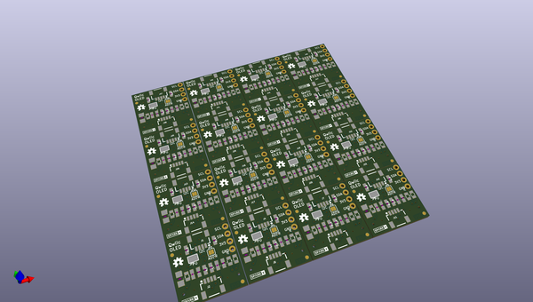

# OOMP Project  
## Qwiic_Micro_OLED  by sparkfunX  
  
oomp key: oomp_projects_flat_sparkfunx_qwiic_micro_oled  
(snippet of original readme)  
  
Qwiic_Micro_OLED  
========================================  
  
  
[*SPX-14269*](https://www.sparkfun.com/products/14269)  
  
The Qwiic Micro OLED is a small monochrome, blue-on-black OLED. It’s "micro", but it still packs a punch – the OLED display is crisp, and you can fit a deceivingly large amount of graphics on there. This breakout is perfect for adding graphics to your next project or displaying diagnostic information without resorting to serial output.  
  
The Qwiic version of the Micro OLED has two Qwiic connectors that allow you to easily and quickly attach the display to the Qwicc Shield of your choosing.The [Qwiic system](http://www.sparkfun.com/qwiic) enables fast and solderless connection between popular platforms and various sensors and actuators. You can read more about the Qwiic system [here](http://www.sparkfun.com/qwiic).   
  
License Information  
-------------------  
  
This product is _**open source**_!  
  
Please review the LICENSE.md file for license information.  
  
If you have any questions or concerns on licensing, please contact techsupport@sparkfun.com.  
  
Distributed as-is; no warranty is given.  
  
- Your friends at SparkFun.  
  
_<COLLABORATION CREDIT>_  
  
  full source readme at [readme_src.md](readme_src.md)  
  
source repo at: [https://github.com/sparkfunX/Qwiic_Micro_OLED](https://github.com/sparkfunX/Qwiic_Micro_OLED)  
## Board  
  
  
## Schematic  
  
  
  
[schematic pdf](working_schematic.pdf)  
## Images  
