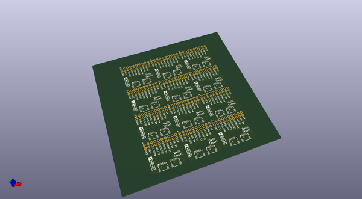

# OOMP Project  
## Qwiic_Module_for_Tessel_2  by sparkfunX  
  
oomp key: oomp_projects_flat_sparkfunx_qwiic_module_for_tessel_2  
(snippet of original readme)  
  
Qwiic Module for Tessel 2  
========================================  
  
  
  
[*SPX-14334*](https://www.sparkfun.com/products/14334)  
  
A small breakout board to connect the Tessel 2 to the Qwiic System.  
  
The [Qwiic system](http://www.sparkfun.com/qwiic) enables fast and solderless connection between popular platforms and various sensors and actuators. You can read more about the Qwiic system [here](http://www.sparkfun.com/qwiic).   
  
License Information  
-------------------  
  
This product is _**open source**_!  
  
Please review the LICENSE.md file for license information.  
  
If you have any questions or concerns on licensing, please contact techsupport@sparkfun.com.  
  
Distributed as-is; no warranty is given.  
  
- Your friends at SparkFun.  
  
_<COLLABORATION CREDIT>_  
  
  
  full source readme at [readme_src.md](readme_src.md)  
  
source repo at: [https://github.com/sparkfunX/Qwiic_Module_for_Tessel_2](https://github.com/sparkfunX/Qwiic_Module_for_Tessel_2)  
## Board  
  
  
## Schematic  
  
  
  
[schematic pdf](working_schematic.pdf)  
## Images  
