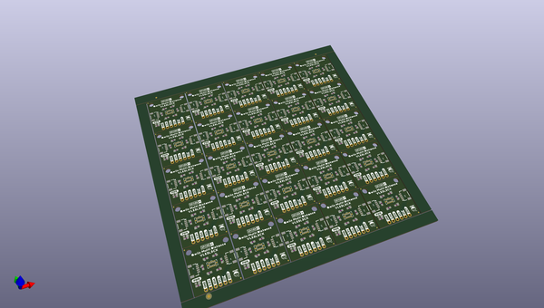

# OOMP Project  
## Qwiic_Multi_Distance_VL53L3CX  by sparkfunX  
  
(snippet of original readme)  
  
SparkX Qwiic Multi Distance Sensor - VL53L3CX  
========================================  
  
  
  
[*Qwiic Multi Distance Sensor - VL53L3CX(SPX-17072)*](https://www.sparkfun.com/products/17072)  
  
The VL53L3CX is an awesome ToF (Time of Flight) range finder from STMicroelectronics, who brought us the venerable VL53L1X. It shares the same diminutive form factor as its predecessor but has learned a cool new trick: Multi-object detection! With some very fancy algorithms, the VL53L3CX is able to detect different objects within the field of view with depth understanding, something that isn't very common in laser range finders. The VL53L3CX has a field of view of about 25° and is able to detect objects up to 3 meters away, making it ideal for robotics, IoT, and smart lighting applications.   
  
Our Qwiic Multi Distance Sensor breakout provides a simple, solder-free way to prototype using this tiny sensor. If you _want_ to solder, however, we have also provided 0.1" headers for the power, I²C, interrupt, and shutdown pins.   
  
No Arduino library is available for the VL53L3CX as of yet, however a full set of C and Linux [software drivers](https://www.st.com/content/st_com/en/products/embedded-software/proximity-sensors-software/stsw-img015.html) are available from STMicroelectronics.  
  
SparkFun labored with love to create this code. Feel like supporting open so  
  full source readme at [readme_src.md](readme_src.md)  
  
source repo at: [https://github.com/sparkfunX/Qwiic_Multi_Distance_VL53L3CX](https://github.com/sparkfunX/Qwiic_Multi_Distance_VL53L3CX)  
## Board  
  
  
## Schematic  
  
  
  
[schematic pdf](working_schematic.pdf)  
## Images  
