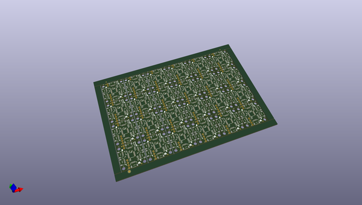

# OOMP Project  
## Qwiic_Mux_PCA9846  by sparkfunX  
  
(snippet of original readme)  
  
SparkFun PCA9846 Qwiic I2C Mux  
===========================================================  
  
  
  
[*SparkX Qwiic Mux - PCA9846 (SPX-22362)*](https://www.sparkfun.com/products/22362)  
  
Do you have too many sensors with the same I2C address? Connect them to the SparkX PCA9846 Qwiic Mux to get them all talking on the same bus! This Qwiic Mux enables communication with multiple I2C devices that have the same address. This Qwiic Mux also has eight configurable addresses of its own, allowing for up to 32 I2C buses on a single connection. To make it even easier to use this multiplexer, all communication is enacted exclusively via I2C, utilizing our handy Qwiic system.  
  
The PCA9846 Qwiic Mux is very similar to our classic [8-channel Qwiic Mux](https://www.sparkfun.com/products/16784), except:  
  
* It has four multiplexed Qwiic ports, plus Qwiic Main In and Out connections, on a super-cute 1" x 1" PCB  
* The PCA9846 has a "Who Am I" (Device ID) product identification register which makes it _much_ easier to detect in auto-detect DataLogger / OpenLog applications.  
  
Feel like supporting open source hardware?   
Buy a [board](https://www.sparkfun.com/products/22362) from SparkFun!  
  
Repository Contents  
-------------------  
  
* **/Documents** - Datasheet for the PCA9846  
* **/Hardware** - Eagle CAD files for t  
  full source readme at [readme_src.md](readme_src.md)  
  
source repo at: [https://github.com/sparkfunX/Qwiic_Mux_PCA9846](https://github.com/sparkfunX/Qwiic_Mux_PCA9846)  
## Board  
  
  
## Schematic  
  
  
  
[schematic pdf](working_schematic.pdf)  
## Images  
