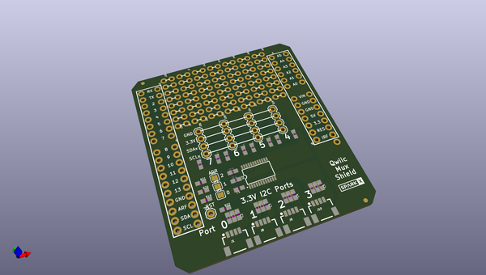

# OOMP Project  
## Qwiic_Mux_Shield_for_Arduino  by sparkfunX  
  
oomp key: oomp_projects_flat_sparkfunx_qwiic_mux_shield_for_arduino  
(snippet of original readme)  
  
  
  full source readme at [readme_src.md](readme_src.md)  
  
source repo at: [https://github.com/sparkfunX/Qwiic_Mux_Shield_for_Arduino](https://github.com/sparkfunX/Qwiic_Mux_Shield_for_Arduino)  
## Board  
  
  
## Schematic  
  
  
  
[schematic pdf](working_schematic.pdf)  
## Images  
