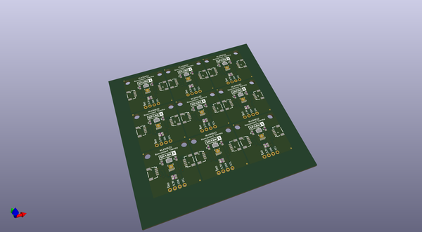

# OOMP Project  
## Qwiic_NonContact_Thermo_MLX90632  by sparkfunX  
  
oomp key: oomp_projects_flat_sparkfunx_qwiic_noncontact_thermo_mlx90632  
(snippet of original readme)  
  
SparkFun Melexis MLX90632 Qwiic Breakout  
===========================================================  
  
  
  
[*SparkX Infrared Non-contact Thermometer (Qwiic) - MLX90632 (SPX-14569)*](https://www.sparkfun.com/products/14569)  
  
The SparkFun Infrared Non-contact Thermometer uses the MLX90632 FIR sensor to detect surface temperature without touching the object. This gives you amazing 1 C prescision from a distance of a few inches.  
  
The [Qwiic system](http://www.sparkfun.com/qwiic) enables fast and solderless connection between popular platforms and various sensors and actuators. You can read more about the Qwiic system [here](http://www.sparkfun.com/qwiic).   
  
License Information  
-------------------  
  
This product is _**open source**_!  
  
Please review the LICENSE.md file for license information.  
  
If you have any questions or concerns on licensing, please contact techsupport@sparkfun.com.  
  
Distributed as-is; no warranty is given.  
  
- Your friends at SparkFun.  
  
_<COLLABORATION CREDIT>_  
  
  full source readme at [readme_src.md](readme_src.md)  
  
source repo at: [https://github.com/sparkfunX/Qwiic_NonContact_Thermo_MLX90632](https://github.com/sparkfunX/Qwiic_NonContact_Thermo_MLX90632)  
## Board  
  
  
## Schematic  
  
  
  
[schematic pdf](working_schematic.pdf)  
## Images  
