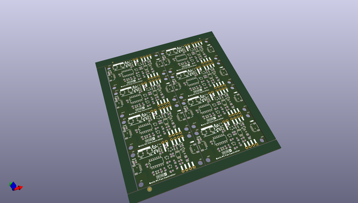

# OOMP Project  
## Qwiic_PC_Fan_Controller  by sparkfunX  
  
oomp key: oomp_projects_flat_sparkfunx_qwiic_pc_fan_controller  
(snippet of original readme)  
  
Qwiic PC Fan Controller  
========================================  
  
  
  
[*Qwiic PC Fan Controller (SPX-18570)*](https://www.sparkfun.com/products/18570)  
  
Whether for active cooling or ventilation, a tiny fan can make a big difference. And by that logic a big fan can make an even bigger difference! Luckily, 4-Wire PC cooling fans come in all shapes and sizes, so there's definitely one out there that's perfect for your project. The only downside is that they can be a pain to drive if you don't need them to be 100% on the throttle all the time. To remedy this, we've modified our Qwiic Blower Fan board to drive any 3- or 4-wire PC Fan with any voltage from 5 to 20VDC!  
  
The Qwiic PC Fan Controller allows you easily control almost any PC fan over the Qwiic bus using the on board ATtiny microcontroller and control firmware. The control firmware monitors the tachometer output of the fan in order to implement PI Control over the fan speed, allowing you to set your desired speed in real units. It's also possible to disable the PI control loop and set the speed as a proportion of the maximum. The accompanying Arduino library includes example code for controlling the fan, tweaking settings, and even setting the fan speed based on an attached Qwiic Temperature Sensor and a lookup table. The on board trimpots allow you to very quickly tune the PI loop parameters to your application,  
  full source readme at [readme_src.md](readme_src.md)  
  
source repo at: [https://github.com/sparkfunX/Qwiic_PC_Fan_Controller](https://github.com/sparkfunX/Qwiic_PC_Fan_Controller)  
## Board  
  
  
## Schematic  
  
  
  
[schematic pdf](working_schematic.pdf)  
## Images  
