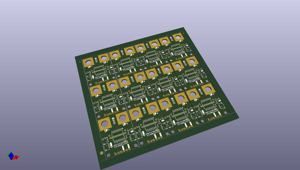

# OOMP Project  
## Qwiic_Power_Meter-ACS37800  by sparkfunX  
  
oomp key: oomp_projects_flat_sparkfunx_qwiic_power_meter_acs37800  
(snippet of original readme)  
  
SparkX Power Meter - ACS37800 (Qwiic)  
===================================================  
  
  
  
[*SparkX Power Meter - ACS37800 (Qwiic) (SPX-17873)*](https://www.sparkfun.com/products/17873)  
  
  
  
Need a power sensor that can sense voltage up to 60VDC and current up to 30A? This is the product for you!  
  
The Allegro MicroSystems ACS37800 power monitoring IC greatly simplifies the addition of power monitoring to many powered systems and is ideal for  
heavy current applications like:  
- Monitoring the power drawn by a 3D-printer  
- Monitoring the power drawn from a UAV battery  
- Battery charging / conditioning  
- Solar / photovoltaic panel power monitoring  
  
Allegro’s Hall-effect-based, galvanically isolated current sensing technology achieves reinforced isolation ratings in a small PCB footprint.  
These features enable isolated current sensing without expensive Rogowski coils, oversized current transformers, isolated operational amplifiers,  
or the power loss of shunt resistors.  
  
The ACS37800 power monitoring IC offers key power measurement parameters that can easily be accessed through its digital interface. Dedicated and  
configurable I/O pins for voltage/current zero crossing, undervoltage and overvoltage reporting, and fast overcurrent fault de  
  full source readme at [readme_src.md](readme_src.md)  
  
source repo at: [https://github.com/sparkfunX/Qwiic_Power_Meter-ACS37800](https://github.com/sparkfunX/Qwiic_Power_Meter-ACS37800)  
## Board  
  
  
## Schematic  
  
  
  
[schematic pdf](working_schematic.pdf)  
## Images  
