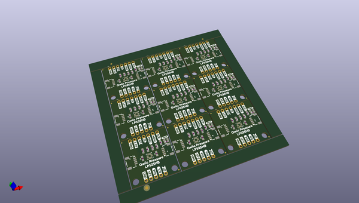

# OOMP Project  
## Qwiic_Pressure-LPS25HB  by sparkfunX  
  
oomp key: oomp_projects_flat_sparkfunx_qwiic_pressure_lps25hb  
(snippet of original readme)  
  
SparkFun Qwiic Pressure with LPS25HB  
========================================  
  
  
  
[*Qwiic Pressure Sensor - LPS25HB (SPX-14767)*](https://www.sparkfun.com/products/14767)  
  
The LPS25HB is an absolute pressure sensor which means that it has an internal vacuum as a reference. (As opposed to *differential* and *gage* sensors, see [this](https://cdn.sparkfun.com/assets/e/1/2/4/1/HoneywellTechnicalNote_Absolute_v_Gage_pressure.pdf) description by Honeywell for more info) Absolute pressure sensors are often used as altimeters however they can be seen in other applications like the [Robotic Finger Sensor v2](https://www.sparkfun.com/products/14687).   
  
You can use this absolute pressure sensor to inform a drone autopilot of altitude, make a personal weather station, or maybe even help test someone's lung function! As part of the Qwiic system adding more capabilities like data logging with the [Qwiic OpenLog](https://www.sparkfun.com/products/14641) is a cinch!  
  
The LPS25HB is the newest version of the LPS25H by STMicroelectronics featuring the widest range of sensing pressures (26 kPa to 126 kPa) and very high precision (as low as 1 Pa RMS, which equates to approximately 8 centimeters of air at sea level). Other features such as the 25 Hz update rate and durability to withstand nearly 2.5 MPa over-pressure make this a great choice for absolute pressure sensor.  
  full source readme at [readme_src.md](readme_src.md)  
  
source repo at: [https://github.com/sparkfunX/Qwiic_Pressure-LPS25HB](https://github.com/sparkfunX/Qwiic_Pressure-LPS25HB)  
## Board  
  
  
## Schematic  
  
  
  
[schematic pdf](working_schematic.pdf)  
## Images  
