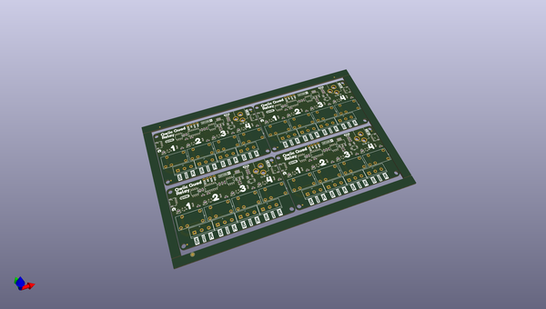

# OOMP Project  
## Qwiic_Quad_Relay  by sparkfunX  
  
(snippet of original readme)  
  
SparkX Qwiic Quad Relay  
========================================  
  
->  <-  
  
[*SparkX Qwiic Quad Relay (SPX-15032)*](https://www.sparkfun.com/products/15032)  
The Qwiic Quad Relay is a product designed for switching not one, but **four** high powered devices, from your Arduino or other low powered microcontroller using I2C. It's rocking four [relays](https://www.sparkfun.com/products/100) on its' PCB rated up to 5 Amps per channel at 250VAC. Each channel is sporting its own colored LED and silk for easy identification, and has screw terminals for easy connection.   
  
The board is made to integrate easily into the [Qwiic environment](https://www.sparkfun.com/qwiic) with Qwiic connectors on each side for easy daisy chaining. At the heart of the product is an ATtiny84 with its own I2C address awaiting for I2C commands that are designated to turn on and off individual channels or _all_ the channels at once! All of this is detailed nicely in provided example code, which also walks you through changing the boards single I2C address. There is a four pin header broken out for those of you not taking advantage of the Qwiic connector.  
  
The onboard barrel jack is rated for wall warts in the range, 7-15V but there is a jumper on the underside in the case that your wal  
  full source readme at [readme_src.md](readme_src.md)  
  
source repo at: [https://github.com/sparkfunX/Qwiic_Quad_Relay](https://github.com/sparkfunX/Qwiic_Quad_Relay)  
## Board  
  
  
## Schematic  
  
  
  
[schematic pdf](working_schematic.pdf)  
## Images  
