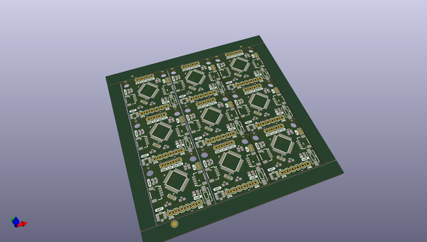

# OOMP Project  
## Qwiic_RF  by sparkfunX  
  
(snippet of original readme)  
  
- Qwiic_RF  
LoRa Radio for the Qwiic System  
  
  full source readme at [readme_src.md](readme_src.md)  
  
source repo at: [https://github.com/sparkfunX/Qwiic_RF](https://github.com/sparkfunX/Qwiic_RF)  
## Board  
  
  
## Schematic  
  
  
  
[schematic pdf](working_schematic.pdf)  
## Images  
