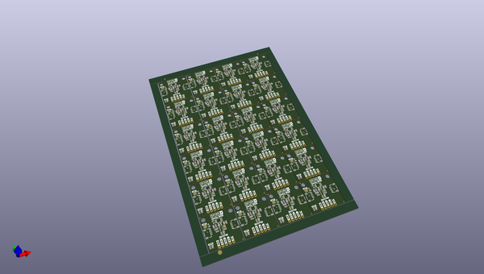

# OOMP Project  
## Qwiic_RGB_BH1749  by sparkfunX  
  
(snippet of original readme)  
  
SparkFun RGB Sensor (Qwiic) - BH1749NUC  
========================================  
  
  
  
[*SparkX RGB Sensor (Qwiic) - BH1749NUC (SPX-14733)*](https://www.sparkfun.com/products/14733)  
  
Need to autonomously monitor for that specific color value? Want to hone in on that magenta ball? Or follow that aquamarine line? The BH1749NUC-based Qwiic RGB Sensor is here for all of your red, green, blue, and infrared color-sensing needs.  
  
The **BH1749NUC** features an I2C interface and a programmable interrupt output. It senses red, green, blue, and infrared in its field-of-view, then reports them as a 16-bit value. Additionally, it features programmable IR and RGB gains and a variable measurement rate.   
  
Also included on the breakout are individually-controllable white, red, green, and blue LEDs. The LEDs are managed with a **PCA9536** 4-channel I/O I2C expander. We've got a library for that too!  
  
Check out the documents section for a pair of Arduino libraries -- for both the [BH1749NUC](https://github.com/sparkfun/SparkFun_BH1749NUC_Arduino_Library) and [PCA9536](https://github.com/sparkfun/SparkFun_PCA9536_Arduino_Library) IC's -- and a handful of examples to help get you started.  
  
The Qwiic RGB Sensor uses   
  full source readme at [readme_src.md](readme_src.md)  
  
source repo at: [https://github.com/sparkfunX/Qwiic_RGB_BH1749](https://github.com/sparkfunX/Qwiic_RGB_BH1749)  
## Board  
  
  
## Schematic  
  
  
  
[schematic pdf](working_schematic.pdf)  
## Images  
