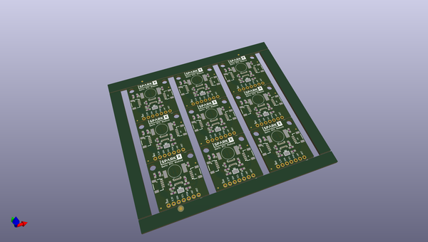

# OOMP Project  
## Qwiic_RTC  by sparkfunX  
  
(snippet of original readme)  
  
SparkFun Qwiic Real Time Clock  
========================================  
  
  
  
[*SparkFun Qwiic RTC (SPX-14642)*](https://www.sparkfun.com/products/14642)  
  
The Qwiic-RTC from SparkFun is a very unique and exciting Real Time Clock. It is extremely precise (within 3 minutes over a year!), extremely low power (less than 22nA!) and has all the necessary oscillators built-in making it very compact.  
  
The RV-1805 has not one, but two internal oscillators: a 32.768kHz tuning fork crystal and a low power RC based oscillator. The RV-1805 automatically switches between oscillators using the more precise crystal to correct the RC oscillator every few minutes. This allows the RTC to maintain a very accurate date and time with the worst case being +/- about 3 minutes over a year. Very few RTCs can come close to this.  
  
The RV-1805 and the library we've written operate the RTC at 22nA. This is *extremely* low power. No external battery needed! We've included a 0.22F super cap on the Qwiic RTC. This *should* maintain the RTC for over 170 days (nearly 6 months) but we have not had 6 months to test this. For now, we guarantee the super cap will maintain the RTC for over a month. That means you can let board sit with no power or connection to the outside world and the current hour/minute/second/date will be maintained. The RV-1805 RTC has a built in trickle charger: as soon as the RTC is   
  full source readme at [readme_src.md](readme_src.md)  
  
source repo at: [https://github.com/sparkfunX/Qwiic_RTC](https://github.com/sparkfunX/Qwiic_RTC)  
## Board  
  
  
## Schematic  
  
  
  
[schematic pdf](working_schematic.pdf)  
## Images  
