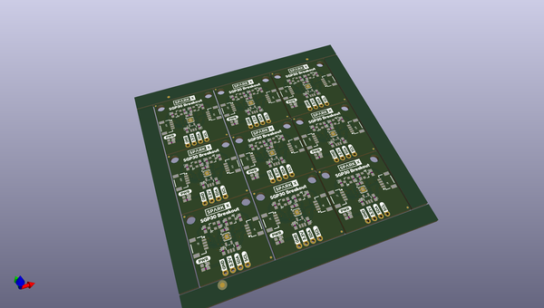

# OOMP Project  
## Qwiic-SGP30-Breakout  by sparkfunX  
  
(snippet of original readme)  
  
Qwiic SGP30 Breakout  
===========================================================  
    
  
[*SparkX SGP30 Breakout (Qwiic) (SPX-14813)*](https://www.sparkfun.com/products/14813)  
  
The SGP30 is an indoor air quality sensor equipped with an I2C interface. It outputs equivalent CO2 in ppm and Total Volatile Organic Compounds (TVOC) in ppb. The sensor also gives access to its raw measurement values of Ethanol and H2.   
  
The SGP30 boasts high stability with low long term drift. With its continuous baseline compensation algorithm, readings stay accurate over time. You can even fine tune your readings by interfacing with an external humidity sensor to add humidity compensation.  
While the CCS811 requires a burn-in of 48 hours and a run-in of 20 minutes the SGP30 is ready to go after just 15 seconds.  
  
This board is one of our many [Qwiic](https://www.sparkfun.com/qwiic) compatible boards! Simply plug and go. No soldering, no figuring out which is SDA or SCL, and no voltage regulation or translation required!  
  
SparkFun labored with love to create this. Feel like supporting open source hardware?   
Buy a [board](https://www.sparkfun.com/products/14813) from SparkFun!  
  
Repository Contents  
-------------------  
  
* **/Hardware** - Eagle design files (.brd, .sch)  
  
Library  
--------------  
* **[Arduino L  
  full source readme at [readme_src.md](readme_src.md)  
  
source repo at: [https://github.com/sparkfunX/Qwiic-SGP30-Breakout](https://github.com/sparkfunX/Qwiic-SGP30-Breakout)  
## Board  
  
  
## Schematic  
  
  
  
[schematic pdf](working_schematic.pdf)  
## Images  
