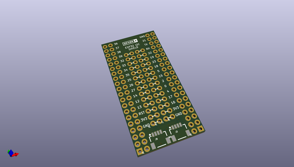

# OOMP Project  
## Qwiic_Shield_for_ESP32  by sparkfunX  
  
oomp key: oomp_projects_flat_sparkfunx_qwiic_shield_for_esp32  
(snippet of original readme)  
  
Qwiic Shield for ESP32   
========================================  
  
  
  
[*SPX-14203*](https://www.sparkfun.com/products/14203)  
  
The Qwiic Shield for ESP32 allows you to quickly and easily connect multiple I2C devices to your [SparkFun ESP32 Thing](https://www.sparkfun.com/products/13907) development board, using the Qwiic connect system. Just plug the shield onto your ESP32, plug in a cable, and start playing with a variety of sensors and actuators. There are two connectors on the same I2C bus so you can connect multiple devices.  
  
License Information  
-------------------  
  
This product is _**open source**_!  
  
Please review the LICENSE.md file for license information.  
  
If you have any questions or concerns on licensing, please contact techsupport@sparkfun.com.  
  
Distributed as-is; no warranty is given.  
  
- Your friends at SparkFun.  
  
_<COLLABORATION CREDIT>_  
  
  full source readme at [readme_src.md](readme_src.md)  
  
source repo at: [https://github.com/sparkfunX/Qwiic_Shield_for_ESP32](https://github.com/sparkfunX/Qwiic_Shield_for_ESP32)  
## Board  
  
  
## Schematic  
  
  
  
[schematic pdf](working_schematic.pdf)  
## Images  
