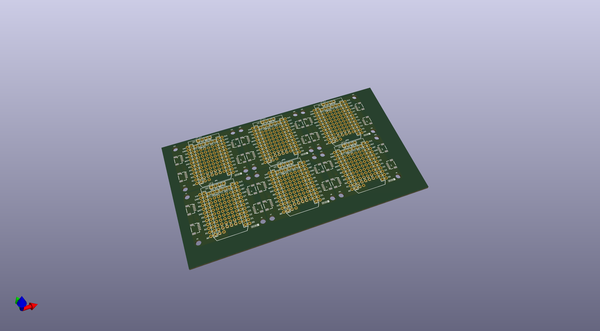

# OOMP Project  
## Qwiic_Shield_for_Photon  by sparkfunX  
  
(snippet of original readme)  
  
Qwiic Shield for Photon   
========================================  
  
  
  
[*SPX-14202*](https://www.sparkfun.com/products/14202)  
  
The Qwiic Shield for Photo connects the I2C bus (GND, 3.3V, SDA, and SCL) from the [Particle Photon](https://www.sparkfun.com/products/13774) to the SparkFun Qwiic system.   
  
License Information  
-------------------  
  
This product is _**open source**_!  
  
Please review the LICENSE.md file for license information.  
  
If you have any questions or concerns on licensing, please contact techsupport@sparkfun.com.  
  
Distributed as-is; no warranty is given.  
  
- Your friends at SparkFun.  
  
_<COLLABORATION CREDIT>_  
  
  full source readme at [readme_src.md](readme_src.md)  
  
source repo at: [https://github.com/sparkfunX/Qwiic_Shield_for_Photon](https://github.com/sparkfunX/Qwiic_Shield_for_Photon)  
## Board  
  
  
## Schematic  
  
  
  
[schematic pdf](working_schematic.pdf)  
## Images  
