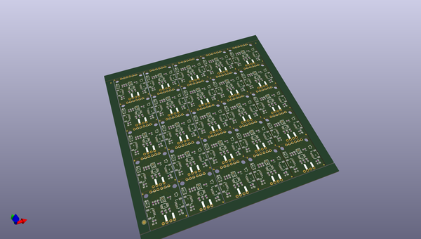

# OOMP Project  
## Qwiic_Sound_Trigger  by sparkfunX  
  
(snippet of original readme)  
  
- Qwiic Sound Trigger  
  
A sound trigger which you can use on its own, or as part of your Qwiic system.  
  
  
  
  
  
[Qwiic Sound Trigger (SPX-17979)](https://www.sparkfun.com/products/17979)  
  
The Qwiic Sound Trigger is based on the VM1010 from Vesper Technologies and the TI PCA9536 GPIO expander.  
  
The VM1010 is a clever little device which can be placed into a very low power "Wake On Sound" mode. When it detects a sound,  
it wakes up and pulls its TRIG (DOUT) pin high. The VM1010 can then be placed into "Normal" mode by pulling the  
MODE pin low; it then functions as a regular microphone. The analog microphone signal is available on the AUDIO (VOUT) pin.  
All of this happens really quickly, within 50 _microseconds_ (_much_ faster than a capacitive MEMS microphone), so you don't miss  
the start of the audio signal.  
  
The noise threshold required to wake the VM1010 can be programmed via the resistance between pins GA1 and GA2. By default, the 20K  
resistor on the breakout sets the noise threshold to close to the minimum (most sensitive) setting. You can increase the threshold  
to maximum (least sensitive) by cutting the THRESH jumper. You can set it mid-way by adding your own resistor between breakout pins GA1 and GA2.  
  
If you are using the VM1010 purely as a   
  full source readme at [readme_src.md](readme_src.md)  
  
source repo at: [https://github.com/sparkfunX/Qwiic_Sound_Trigger](https://github.com/sparkfunX/Qwiic_Sound_Trigger)  
## Board  
  
  
## Schematic  
  
  
  
[schematic pdf](working_schematic.pdf)  
## Images  
