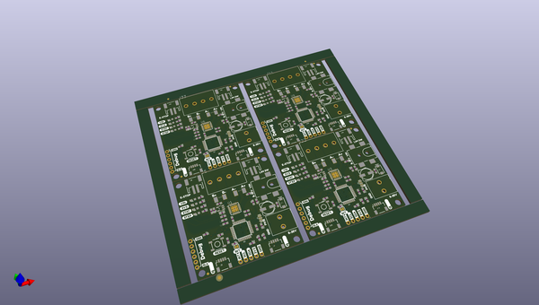

# OOMP Project  
## Qwiic_Step  by sparkfunX  
  
(snippet of original readme)  
  
SparkX Qwiic Step  
========================================  
  
  
  
  
  
[*SparkX Qwiic Step (SPX-15951)*](https://www.sparkfun.com/products/15951)  
  
Qwiic Step features the A4988 stepper motor driver IC. Send commands using the I2C bus to configure your stepper motor movements. Easily attach and set up a limit switch or E-Stop and use our new favorite latching terminals to solderlessly and screwlessly attach motor and power.  
  
Repository Contents  
-------------------  
  
* **/Documentation** - Data sheets, additional product information  
* **/Firmware** - Firmware used on Qwiic Step  
* **/Hardware** - Eagle design files (.brd, .sch)  
* **/Production** - Production panel files (.brd)  
  
Documentation  
--------------  
* **[SparkFun Qwiic Step Arduino Library](https://github.com/sparkfun/SparkFun_Qwiic_Step_Arduino_Library)** - Arduino library for the SparkX Qwiic Step.  
* **[SparkFun Fritzing repo](https://github.com/sparkfun/Fritzing_Parts)** - Fritzing diagrams for SparkFun products.  
* **[SparkFun 3D Model repo](https://github.com/sparkfun/3D_Models)** - 3D models of SparkFun products.   
* **[SparkFun Graphical Datasheets](https://github.com/sparkfun/Graphical_Datasheets)** -  
  full source readme at [readme_src.md](readme_src.md)  
  
source repo at: [https://github.com/sparkfunX/Qwiic_Step](https://github.com/sparkfunX/Qwiic_Step)  
## Board  
  
  
## Schematic  
  
  
  
[schematic pdf](working_schematic.pdf)  
## Images  
