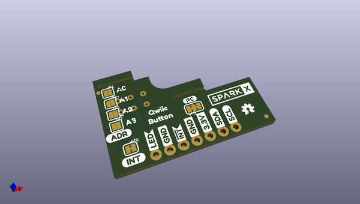

# OOMP Project  
## Qwiic_Switch  by sparkfunX  
  
(snippet of original readme)  
  
SparkFun Qwiic Switch/Arcade  
========================================  
<table class="table table-hover table-striped table-bordered">  
  <tr align="center">  
   <td></td>  
   <td></td>  
   <td></td>  
  </tr>  
  <tr align="center">  
    <td><a href="https://www.sparkfun.com/products/15591">SparkFun Qwiic Arcade - Red (SPX-15591)</a></td>  
    <td><a href="https://www.sparkfun.com/products/15592">SparkFun Qwiic Arcade - Blue (SPX-15592)</a></td>  
    <td><a href="https://www.sparkfun.com/products/15586">SparkFun Qwiic Switch (SPX-15586)</a></td>  
  </tr>  
</table>  
  
The SparkFun Qwiic Switch and Qwiic Arcade are I2C enabled boards with interrupts, variable I2C addresses, external LED output, and onboard button queues.  
  
Repository Contents  
-------------------  
  
* **/Firmware** - Firmware for the built-in ATTiny84 on the Qwiic Button/Switch/Arcade (.h, .ino)  
* **/Hardware** - Eagle design files (.brd, .sch)  
* **/Hardware/Production** - Production panel files (.brd)  
  
Documentation  
--------------  
* **[SparkFun Qwiic Button A  
  full source readme at [readme_src.md](readme_src.md)  
  
source repo at: [https://github.com/sparkfunX/Qwiic_Switch](https://github.com/sparkfunX/Qwiic_Switch)  
## Board  
  
  
## Schematic  
  
  
  
[schematic pdf](working_schematic.pdf)  
## Images  
