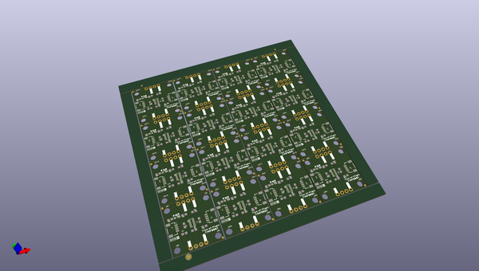

# OOMP Project  
## Qwiic_Time-of-Flight-TMF8801  by sparkfunX  
  
oomp key: oomp_projects_flat_sparkfunx_qwiic_time_of_flight_tmf8801  
(snippet of original readme)  
  
SparkFun Qwiic Time-of-Flight Sensor TMF8801  
============================================  
  
   
  
[*SparkX ToF TMF8801 (SPX-17716)*](https://www.sparkfun.com/products/17716)  
  
TMF8801 is a Time-of-Flight sensor capable of measuring distances up to 98.4 inches (2500 mm) using infrared laser light, based on SPAD, TDC and histogram technology.   
  
The device meets Class 1 laser safety limits including single faults in compliance with IEC / EN 60825-1:2014 per the manufacturer's datasheet.  
  
Repository Contents  
-------------------  
  
* **/documents** - Datasheet, application notes, etc.  
* **/examples** - Example sketches for the library (.ino). Run these from the Arduino IDE.   
* **/src** - Source files for the library (.cpp, .h).  
* **keywords.txt** - Keywords from this library that will be highlighted in the Arduino IDE.   
* **library.properties** - General library properties for the Arduino package manager.   
  
Library  
--------------  
* **[Arduino Library](https://github.com/sparkfun/Sparkfun_TMF8801_Arduino_Library)** - Library for performing measurements and optional device calibration.  
  
License Information  
-------------------  
  
This product is _**open source**_!   
  
Please review the LICENSE.md file for license information.   
  
If you have any questions or concerns on licensing, please contact techsupport@sparkfun.com.  
  
Please use, reuse, and modify these files as you see fit.  
  full source readme at [readme_src.md](readme_src.md)  
  
source repo at: [https://github.com/sparkfunX/Qwiic_Time-of-Flight-TMF8801](https://github.com/sparkfunX/Qwiic_Time-of-Flight-TMF8801)  
## Board  
  
  
## Schematic  
  
  
  
[schematic pdf](working_schematic.pdf)  
## Images  
