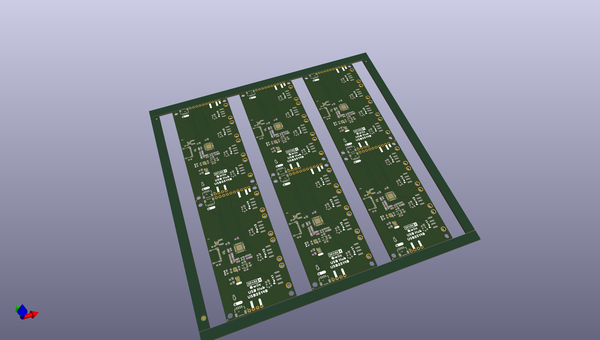

# OOMP Project  
## Qwiic_USB_Hub-USB2514B  by sparkfunX  
  
(snippet of original readme)  
  
SparkFun Qwiic USB Hub - USB2514B  
========================================  
  
  
  
[*SparkX USB Hub - USB2514B (Qwiic) (SPX-18014)*](https://www.sparkfun.com/products/18014)  
  
There are times when you have multiple USB devices in your prototype or device and you just want to plug in one cable. You need a built in USB hub!   
  
The [Qwiic USB Hub](https://www.sparkfun.com/products/18014) is a simple breakout board for the USB2514B USB hub IC. What gives it extra flair is the ability to configure the device over I2C. Out of the box, the board will appear as a standard USB 2.0 Hub; no configuration necessary. Closing the I2C jumper will put the device into configuration mode. We've got an Arduino Library to help you set the various parameters of the hub including VID/PID, downstream max current, even language ID and product names.   
  
Note: Once the configuration bytes are set and the USB2514B is told to 'attach' it will enumerate as a HUB and the configuration cannot be changed until the IC is reset.   
  
The USB2514 is a 4-port 2.0 USB hub. Who cares about USB 2.0 these days? The vast majority of projects we work on have a simple USB-to-Serial IC on it that do not require gigabit datarates. The USB251xB is a simple hub IC allowing multiple USB things to live under one USB connection; this is especially useful when prototyping a new produ  
  full source readme at [readme_src.md](readme_src.md)  
  
source repo at: [https://github.com/sparkfunX/Qwiic_USB_Hub-USB2514B](https://github.com/sparkfunX/Qwiic_USB_Hub-USB2514B)  
## Board  
  
  
## Schematic  
  
  
  
[schematic pdf](working_schematic.pdf)  
## Images  
