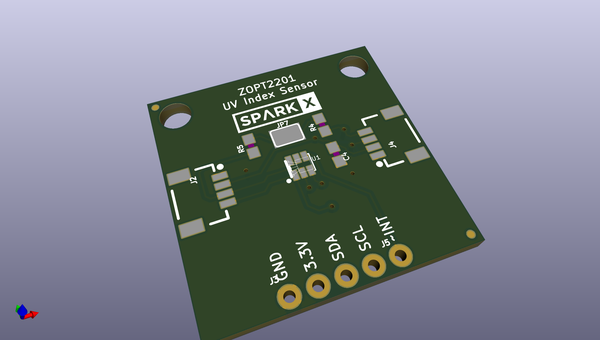

# OOMP Project  
## Qwiic_UV_Sensor-ZOPT220x  by sparkfunX  
  
oomp key: oomp_projects_flat_sparkfunx_qwiic_uv_sensor_zopt220x  
(snippet of original readme)  
  
Qwiic UV Sensor - ZZOPT2201  
========================================  
  
  
  
[*SPX-14264*](https://www.sparkfun.com/products/14264)  
  
The ZOPT2201 is an excellent UVBS (ultraviolet energy sensor) in that it does true 310nm UVB sensing, not interpolated UV from ambient light like most sensors on the market. Without fuss or weird look up tables this sensor gives the current UV Index accurately.  
  
The [Qwiic system](http://www.sparkfun.com/qwiic) enables fast and solderless connection between popular platforms and various sensors and actuators. You can read more about the Qwiic system [here](http://www.sparkfun.com/qwiic).   
  
License Information  
-------------------  
  
This product is _**open source**_!  
  
Please review the LICENSE.md file for license information.  
  
If you have any questions or concerns on licensing, please contact techsupport@sparkfun.com.  
  
Distributed as-is; no warranty is given.  
  
- Your friends at SparkFun.  
  
_<COLLABORATION CREDIT>_  
  
  full source readme at [readme_src.md](readme_src.md)  
  
source repo at: [https://github.com/sparkfunX/Qwiic_UV_Sensor-ZOPT220x](https://github.com/sparkfunX/Qwiic_UV_Sensor-ZOPT220x)  
## Board  
  
  
## Schematic  
  
  
  
[schematic pdf](working_schematic.pdf)  
## Images  
