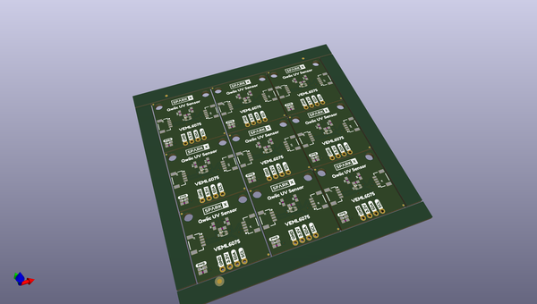

# OOMP Project  
## Qwiic_UV_VEML6075  by sparkfunX  
  
oomp key: oomp_projects_flat_sparkfunx_qwiic_uv_veml6075  
(snippet of original readme)  
  
SparkFun UV Sensor (Qwiic) - VEML6075  
========================================  
  
  
  
[*SparkX UV Sensor (Qwiic) - VEML6075 (SPX-14748)*](https://www.sparkfun.com/products/14748)  
  
Need to apply some sunscreen? SPF 15? SPF 50? SPF 5000? It's time to consult the Qwiic VEML6075 UV sensor!  
  
The **VEML6075** can detect the intensity of UVA (~365nm) and UVB (~330nm) waves. With a quick calculation, those values can be used to generate a standardized **UV index** -- a value from 0 to 11+ which indicates the relative strength of UV irradiance. Seeing a UVI above 6-7? Find some shade, or slather on that sun screen!  
  
The VEML6075 features a simple I2C interface, so we stuck it on a [Qwiic](https://www.sparkfun.com/qwiic)-compatible board. This board requires no voltage translation, no figuring out which pin is SDA or SCL; just plug it in and go!  
  
Check out our [SparkFun_VEML6075_Arduino_Library repo](https://github.com/sparkfun/SparkFun_VEML6075_Arduino_Library) for a simple Arduino library -- there's example code to configure the sensor, read its UVA and UVB outputs, and generate a UV index output. Stay safe out there this summer!  
  
SparkFun labored with love to create this code. Feel like supporting open source hardware?   
Buy a [breakout board](https://www.sparkfun.com/products/14748) from SparkFun!  
  
Repository Contents  
-------------------  
  
* **/Do  
  full source readme at [readme_src.md](readme_src.md)  
  
source repo at: [https://github.com/sparkfunX/Qwiic_UV_VEML6075](https://github.com/sparkfunX/Qwiic_UV_VEML6075)  
## Board  
  
  
## Schematic  
  
  
  
[schematic pdf](working_schematic.pdf)  
## Images  
