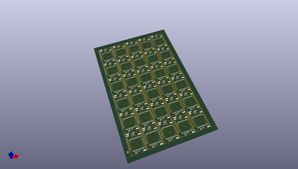

# OOMP Project  
## RFM97CW_Breakout  by sparkfunX  
  
oomp key: oomp_projects_flat_sparkfunx_rfm97cw_breakout  
(snippet of original readme)  
  
SparkFun RFM97C Mini Shield LoRa - 100mW  
========================================  
  
  
  
[*SparkFun RFM97C Mini Shield LoRa - 100mW (SPX-18574)*](https://www.sparkfun.com/products/18574)  
  
The RFM97C is a great little module that incorporates the [SX1276 LoRa transceiver](https://www.semtech.com/products/wireless-rf/lora-core/sx1276) from Semtech. LoRa is best for long range communication (hundreds of feet), low power, and low data rates (~500bps). This 'Mini Shield' is designed to be attached to the top or bottom of any of our Thing Plus boards. Pictured is the [ESP32 Thing Plus](https://www.sparkfun.com/products/18018). We include a PTH soldering point for a low cost wire antenna (~3" for 915MHz) along side a stress relief hole. For folks that need a bit more oomph, there is a U.FL connector available for larger, external RP-SMA LoRa antennas.  
  
Our example sketches make quick work of the initial setup, and the RadioLib Arduino Library makes advanced configuration and [protocols](https://github.com/jgromes/RadioLib/wiki/Default-configuration-protocols) (AX.25, Hellschreiber, Morse, RTTY, and SSTV) a cinch too!  
  
Repository Contents  
-------------------  
  
* **/Documents** - Datasheets and mechanical drawings  
* **/Firmware** - Example sketch(es)  
* **/Hardware** - All Eagle design files (.brd, .sch, .STL)  
  
P  
  full source readme at [readme_src.md](readme_src.md)  
  
source repo at: [https://github.com/sparkfunX/RFM97CW_Breakout](https://github.com/sparkfunX/RFM97CW_Breakout)  
## Board  
  
  
## Schematic  
  
  
  
[schematic pdf](working_schematic.pdf)  
## Images  
