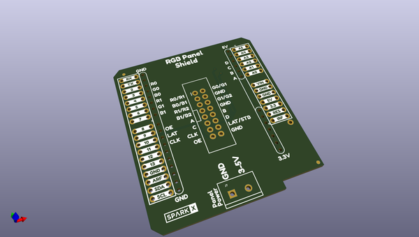

# OOMP Project  
## RGB_Panel_Arduino_Shield  by sparkfunX  
  
(snippet of original readme)  
  
SparkFun RGB Panel Shield  
========================================  
  
  
  
[*SparkX RGB Panel Shield (SPX-14721)*](https://www.sparkfun.com/products/14721)  
  
RGB panels are excellent fun but wiring them up can be a pain. This simple shield for Arduino connects the necessary 14 digital pins to drive our [32x32 RGB panel](https://www.sparkfun.com/products/14646). This comes as a bag of parts but once you've soldered the handful of components it's as easy as plugging on the 2x8 connector from the RGB panel to the shield and you're off to the races.  
  
This shield is guaranteed to work with our [32x32 RGB panel](https://www.sparkfun.com/products/14646) but has been designed to work with nearly all 32x32 pixel panels available on the market.   
  
**Note:** This shield routes the CLK signal to pin 11. This makes the shield compatible with both Uno and Mega but you will need to change the define at the top of your sketch to:  
  
    -define CLK 11  
  
SparkFun labored with love to create this product. Feel like supporting open source hardware?   
Buy a [board](https://www.sparkfun.com/products/14721) from SparkFun!  
  
Repository Contents  
-------------------  
  
* **/Hardware** - Eagle design files (.brd, .sch)  
  
License Information  
-------------------  
  
This product is _**open source**_!   
  
Please review the LICENSE.md file for license information.   
  
If you have any questions or concerns on licensing, pleas  
  full source readme at [readme_src.md](readme_src.md)  
  
source repo at: [https://github.com/sparkfunX/RGB_Panel_Arduino_Shield](https://github.com/sparkfunX/RGB_Panel_Arduino_Shield)  
## Board  
  
  
## Schematic  
  
  
  
[schematic pdf](working_schematic.pdf)  
## Images  
